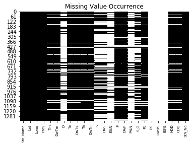
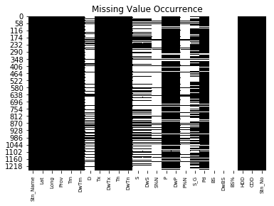
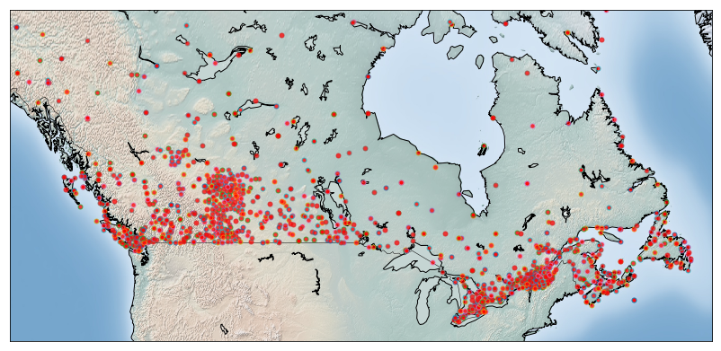
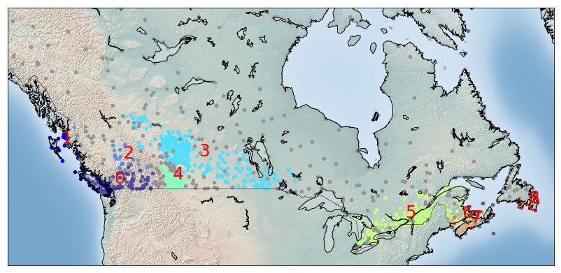

### About the dataset

		
<h4 align = "center">
Environment Canada    
Monthly Values for July - 2015	
</h4>
<html>
<head>
<style>
table {
    font-family: arial, sans-serif;
    border-collapse: collapse;
    width: 100%;
}

td, th {
    border: 1px solid #dddddd;
    text-align: left;
    padding: 8px;
}

tr:nth-child(even) {
    background-color: #dddddd;
}
</style>
</head>
<body>

<table>
  <tr>
    <th>Name in the table</th>
    <th>Meaning</th>
  </tr>
  <tr>
    <td><font color = "green"><strong>Stn_Name</font></td>
    <td><font color = "green"><strong>Station Name</font</td>
  </tr>
  <tr>
    <td><font color = "green"><strong>Lat</font></td>
    <td><font color = "green"><strong>Latitude (North+, degrees)</font></td>
  </tr>
  <tr>
    <td><font color = "green"><strong>Long</font></td>
    <td><font color = "green"><strong>Longitude (West - , degrees)</font></td>
  </tr>
  <tr>
    <td>Prov</td>
    <td>Province</td>
  </tr>
  <tr>
    <td>Tm</td>
    <td>Mean Temperature (°C)</td>
  </tr>
  <tr>
    <td>DwTm</td>
    <td>Days without Valid Mean Temperature</td>
  </tr>
  <tr>
    <td>D</td>
    <td>Mean Temperature difference from Normal (1981-2010) (°C)</td>
  </tr>
  <tr>
    <td><font color = "black">Tx</font></td>
    <td><font color = "black">Highest Monthly Maximum Temperature (°C)</font></td>
  </tr>
  <tr>
    <td>DwTx</td>
    <td>Days without Valid Maximum Temperature</td>
  </tr>
  <tr>
    <td><font color = "black">Tn</font></td>
    <td><font color = "black">Lowest Monthly Minimum Temperature (°C)</font></td>
  </tr>
  <tr>
    <td>DwTn</td>
    <td>Days without Valid Minimum Temperature</td>
  </tr>
  <tr>
    <td>S</td>
    <td>Snowfall (cm)</td>
  </tr>
  <tr>
    <td>DwS</td>
    <td>Days without Valid Snowfall</td>
  </tr>
  <tr>
    <td>S%N</td>
    <td>Percent of Normal (1981-2010) Snowfall</td>
  </tr>
  <tr>
    <td><font color = "green"><strong>P</font></td>
    <td><font color = "green"><strong>Total Precipitation (mm)</font></td>
  </tr>
  <tr>
    <td>DwP</td>
    <td>Days without Valid Precipitation</td>
  </tr>
  <tr>
    <td>P%N</td>
    <td>Percent of Normal (1981-2010) Precipitation</td>
  </tr>
  <tr>
    <td>S_G</td>
    <td>Snow on the ground at the end of the month (cm)</td>
  </tr>
  <tr>
    <td>Pd</td>
    <td>Number of days with Precipitation 1.0 mm or more</td>
  </tr>
  <tr>
    <td>BS</td>
    <td>Bright Sunshine (hours)</td>
  </tr>
  <tr>
    <td>DwBS</td>
    <td>Days without Valid Bright Sunshine</td>
  </tr>
  <tr>
    <td>BS%</td>
    <td>Percent of Normal (1981-2010) Bright Sunshine</td>
  </tr>
  <tr>
    <td>HDD</td>
    <td>Degree Days below 18 °C</td>
  </tr>
  <tr>
    <td>CDD</td>
    <td>Degree Days above 18 °C</td>
  </tr>
  <tr>
    <td>Stn_No</td>
    <td>Climate station identifier (first 3 digits indicate   drainage basin, last 4 characters are for sorting alphabetically).</td>
  </tr>
  <tr>
    <td>NA</td>
    <td>Not Available</td>
  </tr>


</table>

</body>
</html>

 


```python
import csv
import pandas as pd
import numpy as np
df=pd.read_csv('https://s3-api.us-geo.objectstorage.softlayer.net/cf-courses-data/CognitiveClass/ML0101ENv3/labs/weather-stations20140101-20141231.csv')
print(df.count())
print('n_cols:', len(df.columns) )
```

    Stn_Name    1341
    Lat         1341
    Long        1341
    Prov        1341
    Tm          1256
    DwTm        1256
    D            357
    Tx          1260
    DwTx        1260
    Tn          1260
    DwTn        1260
    S            586
    DwS          586
    S%N          198
    P           1227
    DwP         1227
    P%N          209
    S_G          798
    Pd          1227
    BS             0
    DwBS           0
    BS%            0
    HDD         1256
    CDD         1256
    Stn_No      1341
    dtype: int64
    n_cols: 25


```python
## Check for missing value
%matplotlib inline
import seaborn as sns
import matplotlib.pyplot as plt
ax=plt.subplot(111)
sns.heatmap(df.isnull(),cbar=False,cmap='Greys_r')
ax.set_xticklabels(df.columns, rotation='vertical',fontsize=7)
plt.title('Missing Value Occurrence')
plt.show()
```





```python
pdf = df[pd.notnull(df["Tm"])]
pdf = pdf.reset_index(drop=True)
pdf.head(5)
## Check for missing value
%matplotlib inline
import seaborn as sns
import matplotlib.pyplot as plt
ax=plt.subplot(111)
sns.heatmap(pdf.isnull(),cbar=False,cmap='Greys_r')
ax.set_xticklabels(pdf.columns, rotation='vertical',fontsize=7)
plt.title('Missing Value Occurrence')
plt.show()
print(pdf.count())
print('n_cols:', len(pdf.columns) )
```





    Stn_Name    1256
    Lat         1256
    Long        1256
    Prov        1256
    Tm          1256
    DwTm        1256
    D            357
    Tx          1256
    DwTx        1256
    Tn          1255
    DwTn        1255
    S            511
    DwS          511
    S%N          182
    P           1144
    DwP         1144
    P%N          193
    S_G          733
    Pd          1144
    BS             0
    DwBS           0
    BS%            0
    HDD         1256
    CDD         1256
    Stn_No      1256
    dtype: int64
    n_cols: 25


```python
##to find proj_lib directory, you can skip this and run straight the #map instead, if u dont have any trouble with PROJ_LIB
import os
import conda
conda_file_dir = conda.__file__
conda_dir = conda_file_dir.split('lib')[0]
proj_lib = os.path.join(os.path.join(conda_dir, 'share'), 'proj')
os.environ["PROJ_LIB"] = proj_lib

##map
from mpl_toolkits.basemap import Basemap
from pylab import rcParams
rcParams['figure.figsize'] = (14,10)
##coordinate
llon=-140
ulon=-50
llat=40
ulat=65

pdf = pdf[(pdf['Long'] > llon) & (pdf['Long'] < ulon) & (pdf['Lat'] > llat) &(pdf['Lat'] < ulat)]

my_map = Basemap(projection='merc',
            resolution = 'l', area_thresh = 1000.0,
            llcrnrlon=llon, llcrnrlat=llat, #min longitude (llcrnrlon) and latitude (llcrnrlat)
            urcrnrlon=ulon, urcrnrlat=ulat) #max longitude (urcrnrlon) and latitude (urcrnrlat)

my_map.drawcoastlines()
my_map.drawcountries()
# my_map.drawmapboundary()
my_map.fillcontinents(color = 'white', alpha = 0.3)
my_map.shadedrelief()

# To collect data based on stations        
xs,ys = my_map(np.asarray(pdf.Long), np.asarray(pdf.Lat))
pdf['xm']= xs.tolist()
pdf['ym'] =ys.tolist()

#Visualization1
for index,row in pdf.iterrows():
#   x,y = my_map(row.Long, row.Lat)
   my_map.plot(row.xm, row.ym,markerfacecolor =([1,0,0]),  marker='o', markersize= 5, alpha = 0.75)
#plt.text(x,y,stn)
plt.show()

```





# Clustering of stations based on Lat&Lon


```python
from sklearn.cluster import DBSCAN
import sklearn.utils
from sklearn.preprocessing import StandardScaler
sklearn.utils.check_random_state(1000)
Clus_dataSet = pdf[['xm','ym']]
Clus_dataSet = np.nan_to_num(Clus_dataSet)
Clus_dataSet = StandardScaler().fit_transform(Clus_dataSet)

# Compute DBSCAN
db = DBSCAN(eps=0.15, min_samples=10).fit(Clus_dataSet)
core_samples_mask = np.zeros_like(db.labels_, dtype=bool)
core_samples_mask[db.core_sample_indices_] = True
labels = db.labels_
pdf["Clus_Db"]=labels
##for outliers, the labels are -1
realClusterNum=len(set(labels)) - (1 if -1 in labels else 0)
clusterNum = len(set(labels)) 
print(clusterNum)
print(realClusterNum)
# A sample of clusters
pdf[["Stn_Name","Tx","Tm","Clus_Db"]].head(5)
```

    6
    5


<div>
<style scoped>
    .dataframe tbody tr th:only-of-type {
        vertical-align: middle;
    }

    .dataframe tbody tr th {
        vertical-align: top;
    }

    .dataframe thead th {
        text-align: right;
    }
</style>
<table border="1" class="dataframe">
  <thead>
    <tr style="text-align: right;">
      <th></th>
      <th>Stn_Name</th>
      <th>Tx</th>
      <th>Tm</th>
      <th>Clus_Db</th>
    </tr>
  </thead>
  <tbody>
    <tr>
      <th>0</th>
      <td>CHEMAINUS</td>
      <td>13.5</td>
      <td>8.2</td>
      <td>0</td>
    </tr>
    <tr>
      <th>1</th>
      <td>COWICHAN LAKE FORESTRY</td>
      <td>15.0</td>
      <td>7.0</td>
      <td>0</td>
    </tr>
    <tr>
      <th>2</th>
      <td>LAKE COWICHAN</td>
      <td>16.0</td>
      <td>6.8</td>
      <td>0</td>
    </tr>
    <tr>
      <th>3</th>
      <td>DUNCAN KELVIN CREEK</td>
      <td>14.5</td>
      <td>7.7</td>
      <td>0</td>
    </tr>
    <tr>
      <th>4</th>
      <td>ESQUIMALT HARBOUR</td>
      <td>13.1</td>
      <td>8.8</td>
      <td>0</td>
    </tr>
  </tbody>
</table>
</div>


```python
rcParams['figure.figsize'] = (14,10)
my_map = Basemap(projection='merc',
            resolution = 'l', area_thresh = 1000.0,
            llcrnrlon=llon, llcrnrlat=llat, #min longitude (llcrnrlon) and latitude (llcrnrlat)
            urcrnrlon=ulon, urcrnrlat=ulat) #max longitude (urcrnrlon) and latitude (urcrnrlat)
my_map.drawcoastlines()
my_map.drawcountries()
# my_map.drawmapboundary()
my_map.fillcontinents(color = 'white', alpha = 0.3)
my_map.shadedrelief()

# To create a color map
colors = plt.get_cmap('jet')(np.linspace(0.0, 1.0, clusterNum))

#Visualization1
for clust_number in set(labels):
    c=(([0.4,0.4,0.4]) if clust_number == -1 else colors[np.int(clust_number)])
    clust_set = pdf[pdf.Clus_Db == clust_number]                    
    my_map.scatter(clust_set.xm, clust_set.ym, color =c,  marker='o', s= 20, alpha = 0.85)
    if clust_number != -1:
        cenx=np.mean(clust_set.xm) 
        ceny=np.mean(clust_set.ym) 
        plt.text(cenx,ceny,str(clust_number), fontsize=25, color='red',)
        print ("Cluster "+str(clust_number)+', Avg Temp: '+ str(np.mean(clust_set.Tm)))
plt.show()
```

    Cluster 0, Avg Temp: 6.221192052980132
    Cluster 1, Avg Temp: 6.790000000000001
    Cluster 2, Avg Temp: -0.49411764705882344
    Cluster 3, Avg Temp: -13.87720930232558
    Cluster 4, Avg Temp: -4.186274509803922
    Cluster 5, Avg Temp: -16.301503759398496
    Cluster 6, Avg Temp: -13.599999999999998
    Cluster 7, Avg Temp: -9.753333333333334
    Cluster 8, Avg Temp: -4.258333333333334


# Clustering of stations based on Lat, Long, mean, max and min temperature


```python
sklearn.utils.check_random_state(1000)
Clus_dataSet = pdf[['xm','ym','Tx','Tm','Tn']]
Clus_dataSet = np.nan_to_num(Clus_dataSet)
Clus_dataSet = StandardScaler().fit_transform(Clus_dataSet)

# Compute DBSCAN
db = DBSCAN(eps=0.3, min_samples=10).fit(Clus_dataSet)
core_samples_mask = np.zeros_like(db.labels_, dtype=bool)
core_samples_mask[db.core_sample_indices_] = True #Indices of core samples
##db.components_ to see the attribute values of core samples found by training
labels = db.labels_
pdf["Clus_Db"]=labels

realClusterNum=len(set(labels)) - (1 if -1 in labels else 0)
clusterNum = len(set(labels)) 


# A sample of clusters
pdf[["Stn_Name","Tx","Tm","Clus_Db"]].head(5)
```


<div>
<style scoped>
    .dataframe tbody tr th:only-of-type {
        vertical-align: middle;
    }

    .dataframe tbody tr th {
        vertical-align: top;
    }

    .dataframe thead th {
        text-align: right;
    }
</style>
<table border="1" class="dataframe">
  <thead>
    <tr style="text-align: right;">
      <th></th>
      <th>Stn_Name</th>
      <th>Tx</th>
      <th>Tm</th>
      <th>Clus_Db</th>
    </tr>
  </thead>
  <tbody>
    <tr>
      <th>0</th>
      <td>CHEMAINUS</td>
      <td>13.5</td>
      <td>8.2</td>
      <td>0</td>
    </tr>
    <tr>
      <th>1</th>
      <td>COWICHAN LAKE FORESTRY</td>
      <td>15.0</td>
      <td>7.0</td>
      <td>0</td>
    </tr>
    <tr>
      <th>2</th>
      <td>LAKE COWICHAN</td>
      <td>16.0</td>
      <td>6.8</td>
      <td>0</td>
    </tr>
    <tr>
      <th>3</th>
      <td>DUNCAN KELVIN CREEK</td>
      <td>14.5</td>
      <td>7.7</td>
      <td>0</td>
    </tr>
    <tr>
      <th>4</th>
      <td>ESQUIMALT HARBOUR</td>
      <td>13.1</td>
      <td>8.8</td>
      <td>0</td>
    </tr>
  </tbody>
</table>
</div>


```python
rcParams['figure.figsize'] = (14,10)

my_map = Basemap(projection='merc',
            resolution = 'l', area_thresh = 1000.0,
            llcrnrlon=llon, llcrnrlat=llat, #min longitude (llcrnrlon) and latitude (llcrnrlat)
            urcrnrlon=ulon, urcrnrlat=ulat) #max longitude (urcrnrlon) and latitude (urcrnrlat)

my_map.drawcoastlines()
my_map.drawcountries()
# my_map.drawmapboundary() #without color like sketch
# my_map.drawmapboundary(fill_color='aqua')
# my_map.fillcontinents(color = 'orange',lake_color='aqua', alpha = 0.8)
my_map.fillcontinents(color = 'white', alpha = 0.3)
my_map.shadedrelief()

# To create a color map
colors = plt.get_cmap('jet')(np.linspace(0.0, 1.0, clusterNum))


#Visualization1
for clust_number in set(labels):
    c=(([0.4,0.4,0.4]) if clust_number == -1 else colors[np.int(clust_number)])
    clust_set = pdf[pdf.Clus_Db == clust_number]                    
    my_map.scatter(clust_set.xm, clust_set.ym, color =c,  marker='o', s= 20, alpha = 1)
    if clust_number != -1:
        cenx=np.mean(clust_set.xm) 
        ceny=np.mean(clust_set.ym) 
        plt.text(cenx,ceny,str(clust_number), fontsize=25, color='red',)
        print ("Cluster "+str(clust_number)+', Avg Temp: '+ str(np.mean(clust_set.Tm)))
```

    Cluster 0, Avg Temp: 6.221192052980132
    Cluster 1, Avg Temp: 6.790000000000001
    Cluster 2, Avg Temp: -0.49411764705882344
    Cluster 3, Avg Temp: -13.87720930232558
    Cluster 4, Avg Temp: -4.186274509803922
    Cluster 5, Avg Temp: -16.301503759398496
    Cluster 6, Avg Temp: -13.599999999999998
    Cluster 7, Avg Temp: -9.753333333333334
    Cluster 8, Avg Temp: -4.258333333333334




